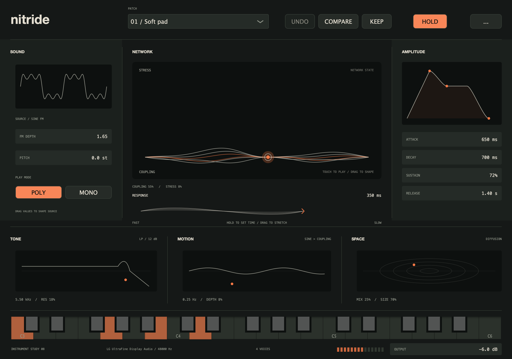
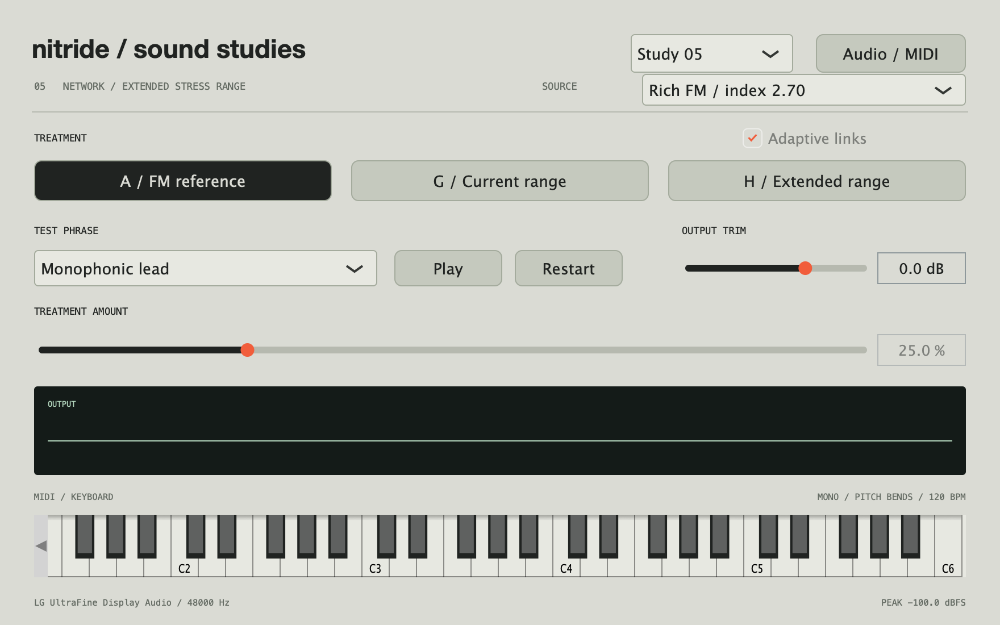
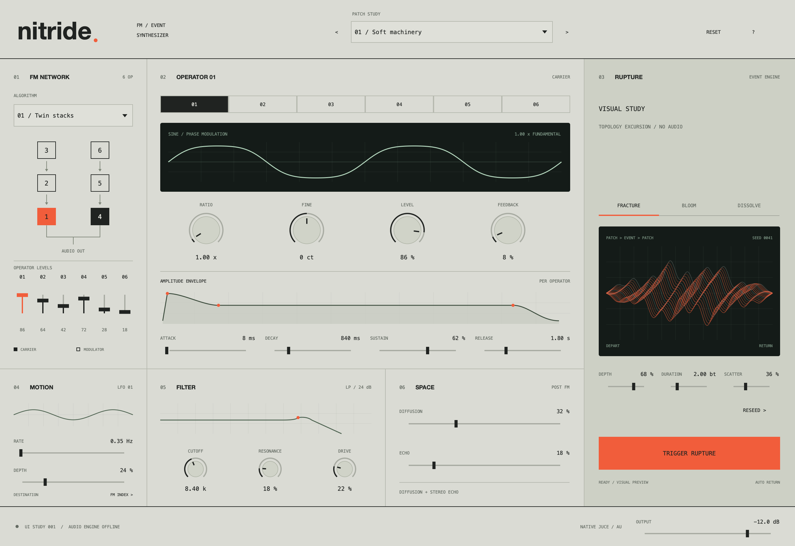

# nitride

A native FM synth project exploring a distinctive sound-making capability.
The approved native interface and audible engine are now connected to a **playable
stereo AU and Standalone instrument** with host automation, session recall and
persistent presets. The sound/gesture studies remain as references.

## Play the instrument

```sh
make standalone
```

The AU is installed locally as `~/Library/Audio/Plug-Ins/Components/nitride.component`.
Select **nitride / nitride** as a stereo AU instrument in your DAW. See
[`docs/MILESTONE_02.md`](docs/MILESTONE_02.md) for automation, preset and verification
details; [`docs/MILESTONE_01.md`](docs/MILESTONE_01.md) records the initial integration.

**Keep** saves a named sound to `~/Library/Application Support/nitride/Presets`.
**Compare** auditions its reference while retaining your edits. **Undo** restores
control gestures or patch selections; the **...** menu includes Redo and preset
import/export. The host can automate all 17 sound controls.

## Shared instrument review

```sh
make review
```

Opens **Nitride Instrument Review**, using the same shared view and rendering path
as the AU. Source, amplitude, tone, motion and space controls are audible;
Keep/Compare/Undo use the shared persistent session and preset workflow. The
original visual review is recorded in
[`docs/INSTRUMENT_REVIEW_08.md`](docs/INSTRUMENT_REVIEW_08.md).



## Playable control study

```sh
make gestures
```

Opens **Nitride Gesture Study**: touch a field to play and shape Coupling/Stress,
hold or stretch a ribbon to set Response, and use Hold or MIDI for sustained
exploration. Pad/Voice/Hit provide starting points. The visuals follow the active
voice's network state. See [`docs/CONTROL_STUDY_06.md`](docs/CONTROL_STUDY_06.md).


### Alternative: visible-object deformation

```sh
make deformation
```

Opens a separate **Nitride Deformation Study**. Pinch/stretch the object's ends for
Coupling and pull its rim for Stress. Grabbing is relative and the shape is retained
on release. The existing field remains available through `make gestures`.
See [`docs/CONTROL_STUDY_07.md`](docs/CONTROL_STUDY_07.md) for the comparison.

## Sound experiments

```sh
make studies
```

Opens **Nitride Sound Studies** on Study 05: FM reference, G's current adaptive
network, and H's extended range. H 0–50% covers G's full range; H 50–100% adds
internal network stress. Start with G 50% and H 25%, then explore H above 50%.
Source profiles, test phrases, keyboard/MIDI and earlier studies remain available.

```sh
make render-studies-05
```

Writes 78 RMS-matched comparisons to `build/sound-studies-05/`, including equivalence
pairs and fixed-link versions. See [`docs/SOUND_STUDIES_05.md`](docs/SOUND_STUDIES_05.md).
The earlier numbered render targets remain.



## Original UI reference

The image below records the original UI hypothesis. The current Standalone uses
the approved instrument view shown above.



### Original sketch

- Six selectable operators with three illustrated FM algorithms.
- Per-operator ratio, fine tuning, level, feedback, and ADSR controls.
- Operator level faders and illustrative waveform / envelope views.
- Motion, filter, diffusion, echo, and output controls.
- Four parameter studies for exploring the control surface.
- Rupture character, depth, duration, scatter, a reseedable trajectory, and a
  timed visual trigger with automatic return.
- Native keyboard-operable sliders and double-click default reset.

Graphs in this original editor
are illustrations, not measured signals. Rupture's timed excursion was an early
interpretation of the brief; its name, mechanism and controls are provisional.
The audible experiments above explore the revised sound-making brief.

## Infrastructure

### Performance measurements

```sh
make benchmark
```

Runs a separate Release processor benchmark across sample rates, buffer sizes and
eight MIDI/automation workloads. JSON reports include audio-budget occupancy,
block-time percentiles, deadline overruns and deterministic audio fingerprints.
Use `PERF_ARGS` to capture/compare baselines. See
[`docs/PERFORMANCE.md`](docs/PERFORMANCE.md) for methodology, measured results and
reproduction commands.

### Native build

Following Carbide's conventions:

- JUCE 8, CMake, C++20.
- macOS 15+, Apple Silicon.
- AUv2 instrument + Standalone targets.
- Native custom `LookAndFeel_V4`, sliders, buttons, combo boxes, and JUCE drawing.
- Processor-owned sound conditions, 17 stable host parameters, versioned session
  recall, persistent presets and Compare/Undo/Redo.
- In-code factory patches in `Source/Instrument/InstrumentSession.h`.
- Native hosted/UI, automation/state and DSP tests registered with CTest.
- Makefile configure / build / test / install / auval / standalone workflow.

The default JUCE path reuses `../carbide/JUCE` without modifying it. Override it
when moving the project or using another checkout:

```sh
make build JUCE_DIR=/absolute/path/to/JUCE
make test
```

Requirements: macOS 15+ on Apple Silicon, macOS SDK + Clang, CMake 3.24+, JUCE 8.

## AU workflow

```sh
make install-au
make validate-au    # auval -v aumu NT01 NTRD
make reload-au      # build, install, validate
```

Restart Logic after replacing the component. The AU is now audible and uses the
approved editor and shared renderer. Apple validation and installed-component MIDI
automation/state-recall and MIDI render checks pass. Logic project save/reopen and
recorded-automation playback are the remaining manual host acceptance checks.

## Key files

| File | Responsibility |
| --- | --- |
| `Source/PluginEditor.*` | Hosts the shared approved instrument view |
| `Source/PluginProcessor.*` | Host MIDI/audio, APVTS automation, factory programs and state |
| `Source/Instrument/*` | Shared conditions, renderer, view and review device wrapper |
| `Source/Instrument/HostParameters.h` | Stable host parameter IDs and ranges |
| `Source/Instrument/PresetStore.*` | Versioned preset files and atomic writes |
| `Source/Tests/UiSelfTests.cpp` | Hosted/review equivalence, MIDI and editor ownership checks |
| `Source/Tests/AutomationStateTests.cpp` | Gestures, automation, session recall and preset workflow |
| `Source/Tests/PerformanceHarness.cpp` | Repeatable Release processor benchmark and baseline comparison |
| `Source/Tests/AuComponentTests.cpp` | Installed AU automation/state and MusicDevice render test |
| `Source/Studies/*` | Audible experiments, audition app, renders, DSP checks |
| `docs/DESIGN.md` | Musical brief, visual direction, open questions |
| `docs/ARCHITECTURE.md` | Native integration and DSP boundary |

Preserve the version-1 host parameter contract in `HostParameters.h` so sessions
and automation stay compatible across subsequent builds.
