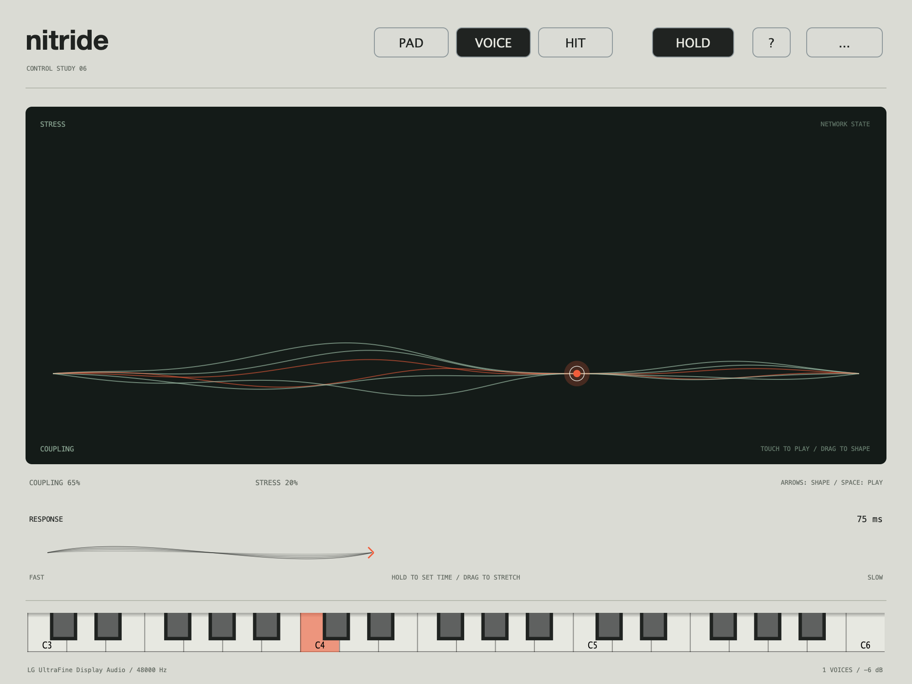

# Control study 06 / playable dimensions

This is a native interaction prototype for the expressive network voice. It tests
whether the controls feel musical and exploratory, with a direct relationship
between gesture, sound and visible response. It is a candidate interaction, not the
finished product surface.

This field is retained as the preferred baseline. A separate object-deformation
alternative is available through `make deformation`; see `CONTROL_STUDY_07.md`.



## Open

```sh
make gestures
```

This opens **Nitride Gesture Study**, separate from the earlier comparison app.
`make studies` still opens the A–H listening comparisons.

## Play and shape

- **Touch the field** to play the selected starting patch. Drag horizontally for
  Coupling and vertically for Stress. Releasing ends the audition note but keeps
  the sound position; there is no automatic excursion/return mechanism.
- **Hold** sustains audition notes so the field and Response can be explored
  independently. It can capture currently held MIDI/on-screen-keyboard notes.
  Turning it off releases the captured notes.
- **Response:** press and hold to establish a duration, or drag the ribbon's tail
  to stretch it. This gesture also plays the selected voice. Its timing changes
  the actual DSP, not just the displayed motion.
- **Pad / Voice / Hit** provide musical starting conditions. Hit has no Hold mode,
  because its envelope is deliberately percussive.
- Play the keyboard or enable a MIDI input in **... → Audio / MIDI**. Auditioning
  uses a reserved internal channel; the field shapes existing input notes without
  adding another audition note when external/on-screen keys are already held.

Keyboard alternatives: focus the field and use arrows to shape, Shift for finer
changes, Space to play. The Response ribbon supports arrows and fine Shift steps.
Both custom surfaces expose accessibility handlers. The options menu includes
reduced motion and output levels -12/-6/0 dB; the initial output is -6 dB.

## Three separate sound dimensions

**Coupling** changes the network's phase interactions, drift/transient response and
its contribution to the generated voice.

**Stress** changes conflicting phase preferences, nonlinear feedback and FM depth.
It is independent of Coupling, rather than forced into the upper half of one macro.

**Response** ranges from 10 ms to 1.6 s. It changes link adaptation rate, phase-offset
evolution speed and transient-drive decay. The carrier frequency and the amplitude
envelope remain separate. Slow Response is intended for longer formation within a
held note; fast Response changes how promptly the internal relationships evolve.

At Response 25 ms, Coupling 50% / Stress 0 reproduces G 50%. Coupling 100% / Stress
50% reproduces H 75%. These mappings are checked numerically. The neutral field
position reproduces the plain FM reference. With Stress but little Coupling, the
stress-controlled voice still contributes, allowing that axis to remain audible.

The new controls use their own voice state. The earlier G/H paths retain their
existing behavior. Preset/job starting positions:

| Starting patch | Coupling | Stress | Response | Audition |
| --- | --- | --- | --- | --- |
| Pad | 55% | 5% | 450 ms | Cmaj9 chord; slower attack/release; simple FM source |
| Voice | 65% | 20% | 75 ms | C4; monophonic articulation/glide; richer FM source |
| Hit | 80% | 40% | 18 ms | C4; short envelope; richer FM source |

These are exploratory starting points, not finished sound presets. Unlike the
controlled A/B studies, the field does not apply RMS-matching or AGC across arbitrary
positions; dynamics are retained and the options menu supplies output adjustment.

## Visual feedback

Six traces use the most recent active voice's oscillator offsets and connection
strengths. Level and relative-phase coherence influence their appearance. They
converge at the gesture point. They are a view of model state, not a measured waveform
or FFT. The audio thread publishes fixed-size atomic snapshots; drawing never reads
the mutable DSP engine directly.

Idle views remain still. Reduced motion removes note-driven shape movement while
retaining direct manipulation and note-state feedback. The chassis, typography and
palette remain native JUCE and local system fonts, with functional interface copy.

## What this pass should tell us

1. Does shaping the field feel like playing the voice rather than operating a panel?
2. Are the two spatial dimensions understandable through exploration?
3. Does the time gesture make Response easier to understand and hear?
4. Is it easy to find a useful sound, retain it, and play it with MIDI?
5. Which feedback is informative, and which feels abstract or distracting?

## Verification

DSP checks cover independent audible axes, audible Response changes, neutral and
legacy mappings, three sample rates, block-size independence, and extreme/fast-response
polyphony with complete release.

The native interaction check covers pointer mapping, retained positions, overlapping
pointer/Space input, play/release, Hold, captured keyboard notes, the time gesture and
accessibility handlers. Native playback covers a held pad and live dimension changes.
The 48 kHz run completed with zero xruns and numerical faults.

Files: `Source/Studies/GestureApplication.cpp` owns this surface and audio/MIDI
boundary; `StudyEngine.*` contains the independent dimensions and network snapshots.
