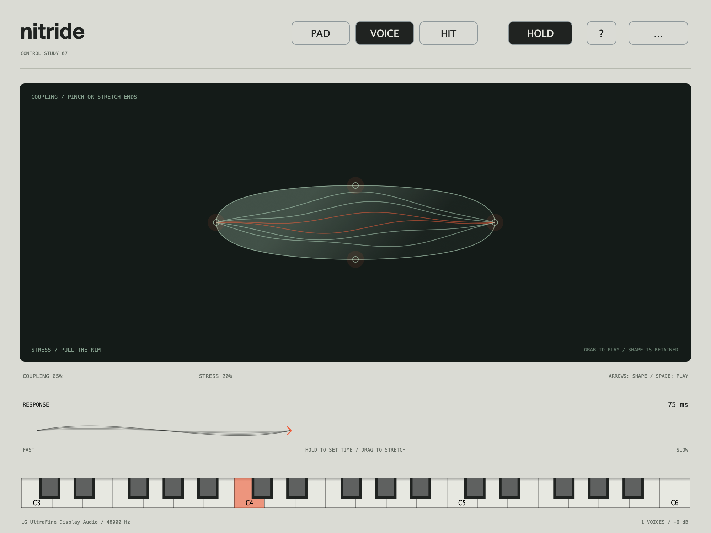

# Control study 07 / deforming a visible object

A separate alternative to the approved playing field. Study 06 remains available
with its existing interaction; this pass does not replace it.



## Open and compare

```sh
make deformation   # Nitride Deformation Study
make gestures      # Original Nitride Gesture Study
```

These are distinct app targets and bundle IDs. They share the audio engine, starting
patches, Response ribbon, Hold/MIDI behavior, output level and display preferences.
The difference is the main interaction surface. Release Hold in one app when
auditioning the other so the voices do not overlap.

## Manipulate the body

- **Ends:** pull them apart to loosen Coupling; pinch them inward to strengthen it.
  The body becomes wider or more compact.
- **Upper/lower rim:** pull outward to increase Stress; press toward the centre to
  reduce it. The body expands and folds vertically.
- **Body:** grabbing its interior plays the voice. A predominantly horizontal drag
  chooses stretching; a predominantly vertical drag chooses the rim-like action.
- **Release:** ends the audition note but retains shape and parameter values.
- **Escape:** cancels the active drag, restoring its starting shape.
- Empty-space clicks do not reposition the object or trigger an audition note.

Grabbing does not change a sound immediately: drags are relative to the starting
shape and selected grip. A dimension locks after the initial interior drag direction
is established. Grips have 24-pixel hit radii and brighten on hover or while active.

Arrows and Shift/fine adjustment remain available; Space plays. Response, Pad/Voice/
Hit, Hold, MIDI, keyboard capture/release, audio settings and reduced motion retain
the previous study's behavior.

## What is visible

The outline represents Coupling and Stress. The translucent body and six internal
traces provide a material-like manipulation target. Internal traces use the active
voice's oscillator offsets and connection strengths, just as the original field did.

This is a representation for controlling the existing synth, not a newly implemented
physical simulation. Sound generation is unchanged. Reduced motion removes note-driven
shape movement while keeping direct manipulation and note-state feedback.

## Tradeoff being tested

Study 06 offers immediate placement and simultaneous two-axis exploration. Study 07
offers a visible, graspable object, relative movement, and a physical distinction
between pinching and pulling. Its costs are discovering the grips and a more constrained
one-dimension-at-a-time drag. It should earn its place by how it feels to play, not
only by looking more like an object.

## Verification

Both targets build natively and pass their interaction checks. Object-specific checks
cover no jump on grab, end/rim mappings, interior dragging, clamped bounds, shape
retention, empty-space clicks and Escape cancellation. Shared checks cover keyboard
and pointer overlap, Hold/captured-note release, Response, and accessibility.

Native 48 kHz playback and release checks completed with zero xruns and numerical
faults. The implementation uses the shared `GestureApplication.cpp` with a target-specific
surface selection, keeping audio and surrounding controls identical between prototypes.
