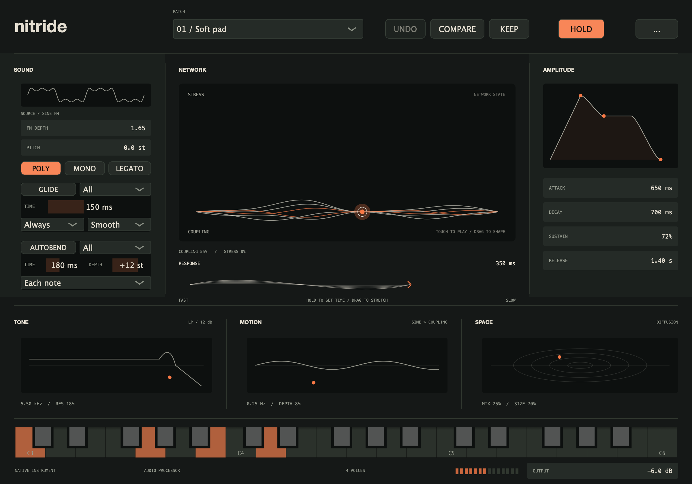

# Glide and Autobend / Nitride 0.3.0

Glide connects notes. Autobend gives each strike a pitch gesture. They can be used
individually or together, and can move the carrier and modulator groups separately.
The native AU, Standalone and instrument review share the implementation.



## Try it

Choose **Contact lead**, then:

1. Set Glide to **All / Smooth / 200 ms** and play a connected phrase.
2. Enable Autobend with **Opposed / +12 st / 180 ms / Each note**.
3. Play overlapping notes. The melody slides while each strike changes the FM
   relationship before settling back into tune.
4. Try negative Depth for upward scoops, or **Modulators** for a bend in the texture
   while the carrier retains its note destination.

Use **Legato** play mode to preserve the amplitude envelope through overlapping
keys. Short Autobends are easiest to hear with a fast amplitude attack; long pad
attacks may need a longer Autobend time.

```sh
make standalone BUILD_DIR=build/performance CONFIG=Release
make install-au BUILD_DIR=build/performance CONFIG=Release
make render-pitch BUILD_DIR=build/performance CONFIG=Release
```

The last command renders seven stereo 24-bit, 48 kHz comparisons under
`build/performance/pitch-motion`: plain, All Glide, Opposed Glide, All Autobend,
Opposed Autobend, combined Glide/Autobend and Pitch + Tone. Each uses the same
six-second lead phrase and output setting. These are listening examples, not a
finished factory preset collection.

## Controls and behavior

### Glide

- Click **GLIDE** to enable it. Turning it off removes the portamento contribution.
- **Time:** 1 ms–5 s.
- **Always:** successive notes glide, including separated notes. The first note
  after initialization has no prior pitch and starts at its destination.
- **Legato only:** glide when keys overlap or when returning to a held key.
  Sustain-pedal-held notes alone do not count as overlapping keys.
- **Smooth:** an eased, linear-in-semitone journey, arriving in the displayed time.
- **Linear:** constant semitone speed, arriving in the displayed time.
- **Classic:** exponential interpolation in frequency, preserving the former
  25 ms mono slide. Time is its time constant: about 3 × Time reaches 95% of
  the frequency interval, rather than representing an exact arrival deadline.

Retargeting starts from the current base Glide pitch. Time automation preserves
progress; changing the curve rebases the remaining journey at the current pitch.
The independent Autobend gesture can add a fresh attack offset to that base.

In poly mode, new notes start from the most recently played note's current base
Glide pitch, independent of the voice allocator. Notes at the same MIDI sample
position share a frozen origin, rather than cascading through one another. This
is a last-note-origin policy, not chord-to-chord voice-leading matching.

### Autobend

- Click **AUTOBEND** to enable it independently of Glide.
- **Time:** 1 ms–5 s; a fast initial movement easing into the destination by the end.
- **Depth:** −36 to +36 semitones. Positive starts above the note and falls into
  tune; negative starts below and scoops upward. The initial default is +12 st,
  with Autobend switched off.
- **Each note:** restart for each fresh note-on.
- **New phrase:** start when there are no previously held keys. Simultaneous
  notes in the first chord share that phrase-start classification.
- Returning to a still-held key does not create a new Autobend strike.

Time changes preserve the current envelope progress. Live depth changes are
dezippered; new strikes initialize at the selected depth. Enable/destination changes
on held voices interpolate routing over 3 ms, preserving oscillator phase.

### Destination bank

Each feature has its own destination:

| Destination | Movement |
| --- | --- |
| Carrier | Reference FM carrier and adaptive-network carrier |
| Modulators | Reference FM modulator and network nodes 1–5, retaining their relative harmonic ratios |
| All | Both groups together, retaining the carrier/modulator ratio |
| Opposed | Carrier and modulators move equally in opposite semitone directions |
| Pitch + Tone | Whole-voice pitch plus movement of the shared tone-filter cutoff |

Glide and Autobend contributions combine in pitch space. Master Pitch and the
global MIDI wheel compose with them. The wheel still spans approximately ±2 st;
master tuning remains ±12 st and no longer consumes the wheel's range at its limits.

### Play modes and ownership

- **Poly:** independent voice trajectories, with the existing 12-voice maximum.
- **Mono:** last-note priority with amplitude retriggering for new strikes.
- **Legato:** monophonic, preserving the envelope on overlapping notes.
- Releasing the newest key returns to the most recent still-held key. Physical
  keys take priority over pedal-held notes. Legato velocity changes have a short
  ramp; returning notes retain their original key velocity.
- Host and editor ownership remain distinct. Hold capture preserves the captured
  press order. Repeated presses are counted so an early note-off cannot release
  the final held owner.
- Voice stealing while pitch motion is enabled carries a 2 ms output taper, and
  Glide origin selection does not depend on whichever voice was stolen.

The engine still groups note release by pitch across owners; this is not an MPE or
per-note MIDI-channel pitch implementation.

### Shared Tone policy

Tone remains a stereo post-mix filter. It follows the latest active voice's pitch
motion, including its release, rather than independently filtering every voice.

Glide's Tone destination adds 1:1 pitch tracking relative to the first note after
all voices have finished. Selecting that destination on a held sound establishes
its anchor at the current base pitch. Autobend adds a transient cutoff offset in
semitones. The displayed cutoff is the base value; the moved cutoff is bounded
between 10 Hz and 0.42 × sample rate.

## Engineering and compatibility

- `Source/DSP/PitchMotion.h` owns sample-clock trajectories and routing ramps,
  independent of JUCE. They advance once per host sample, with continuous
  oscillator phase integration at the engine's existing 4× rate.
- Moving carrier/modulator ratios use a band-limited Bessel sideband expansion
  with a short trigonometric recurrence. Adaptive links respond to the actual
  relative phase movement. Bent ultrasonic carriers and out-of-band modulator
  nodes are attenuated rather than folded into unintended fundamentals.
- Constant-ratio and moving-ratio oscillator paths compile separately. This
  removed an initial ~10% inactive-feature performance regression.
- `Parameters.h` is authoritative for IDs, ranges, defaults, types, choices and
  clamping. `HostParameters.h` remains a compatibility include.
- The original 16 float host controls and **Mono at host index 16** retain their
  IDs and ordering. Eleven version-hint-2 controls are appended, for **28 total**.
  The installed-component test checks all 17 historical AU IDs.
- New IDs: `glide_enabled`, `glide_time`, `glide_target`, `glide_legato`,
  `glide_curve`, `autobend_enabled`, `autobend_time`, `autobend_depth`,
  `autobend_target`, `autobend_phrase`, `legato`.
- JUCE's AU continuous-parameter API uses normalized 0–1 values; its value strings
  show physical units. Indexed destinations use their discrete indices. Preset
  JSON and APVTS raw values use physical units.
- Presets now use version 2; XML/session documents use version 3. Preset v1,
  session/XML v2 and original XML v1 remain loadable. Old mono sounds migrate to
  enabled **All / Classic / 25 ms** Glide with Autobend off. Old poly sounds have
  both features off. The Contact lead factory patch retains its Classic slide.
- Keep, Compare, Undo/Redo, portable presets and host state include every setting.
  Stale slider drags cannot overwrite restored state. Mid-note trajectories,
  sounding notes and evolving network state are not serialized.
- The condition-writer spin-wait has been removed. Host changes publish scalar
  atomics without waiting or entering the document/file lock. Readers take current
  per-control values; this is not a transactional whole-bank snapshot across
  concurrent writers.

## Verification and measurements

All four Release CTest suites pass. Pitch checks cover signed routing, equal
Opposed intervals, combined motion, exact destinations, live time/routing changes,
44.1/48/96 kHz timing, block invariance, mono return-note behavior, legato velocity,
pedal handling, coherent poly chord origins, extreme 12-voice release, audible
Tone routing, automation/UI synchronization, migration and persistence.

An independent direct-FM reference at low frequencies matched within **4.94e−8**
maximum sample error. Separate tests check out-of-band sideband suppression and
ultrasonic bent-carrier suppression. The 32 pre-feature benchmark fingerprints
all matched with new motion unused. Native device playback with both features
enabled passed with **zero xruns and numerical faults**. Apple `auval` passes;
the installed AU passes 28-parameter, legacy-ID, state-recall and real MIDI tests.

### Quantified performance

Apple M4 Max, arm64 Release, Apple Clang 21, three passes × two audio seconds per
case. Values are median pass audio-budget occupancy, not whole-machine CPU usage.
Raw reports are retained under `build/performance/`:

- `pitch-before.json`: DSP at `2267b6c`.
- `pitch-after.json`: the initial branch-heavy implementation.
- `pitch-final.json`: isolated constant/moving-ratio paths; all 32 hashes match.
- `pitch-enabled-48000.json` and `pitch-enabled-96000.json`: matched on/off MIDI
  performances. On/off pairs are expected to sound different.

With new motion unused, typical relative rendering overhead is around **1–2%**,
with measured cases up to approximately 3%. At 48 kHz / 64 frames, steady 12-voice
Stress moved from **47.73% to 48.40%** budget occupancy.

| Matched performance / 64 frames | 48 kHz off → on | 96 kHz off → on |
| --- | ---: | ---: |
| Glide / one lead | 4.01 → 4.06% | 7.72 → 7.82% |
| Opposed Autobend / one lead | 4.02 → 4.07% | 7.70 → 7.76% |
| Both / one lead | 4.02 → 4.10% | 7.71 → 7.80% |
| Both / four-note chords with release tails | 43.02 → 42.36% | 81.93 → 81.00% |
| Glide / 12-voice maximum stress | 48.44 → 49.51% | 95.12 → 98.08% |
| Opposed Autobend / 12-voice maximum stress | 48.53 → 51.65% | 95.15 → 99.62% |
| Both / 12-voice maximum stress | 48.50 → 54.08% | 95.09 → 103.55% |
| Pitch + Tone / 12-note chords | 45.90 → 45.89% | 88.47 → 94.38% |

The chord performances retrigger eight times per second; four-note chords grow to
the 12-voice limit through overlapping release tails. The reports record observed
voice counts. Moving spectra can change rendering cost, so enabling a feature is
not guaranteed to increase every workload's cost.

At 48 kHz, combined maximum stress had p99 **783 µs** against a **1,333 µs**
deadline, with no over-budget blocks in that run. At 96 kHz it had p99 **747 µs**
against **667 µs**, with **8,244 / 9,000** over-budget blocks. That case exceeds the
budget and remains an optimization target. Offline overruns are not measured
device xruns or a substitute for full Logic project acceptance testing.

```sh
make test BUILD_DIR=build/performance CONFIG=Release
make benchmark PERF_ARGS='--pitch-motion --rate 48000 --block 64 --output build/performance/pitch-48k.json'
make benchmark PERF_ARGS='--pitch-motion --rate 96000 --block 64 --output build/performance/pitch-96k.json'
make validate-au
./build/performance/nitride_au_component_tests
```

## Reference

Inspired by Logic Pro's Retro Synth. Apple documents its five destinations,
equal-and-opposite oscillator bending and ±3-octave Autobend range. Retro Synth
selects Glide **or** Autobend in one section; simultaneous independent layers are
an intentional Nitride extension. Timing curves, retrigger details and the shared
Tone policy above are explicit Nitride choices, not claims of identical Retro Synth DSP.

- [Apple: Glide and Autobend](https://support.apple.com/guide/logicpro/glide-and-autobend-modulation-lgsi151fa750/mac)
- [Apple: voice settings](https://support.apple.com/guide/logicpro/global-and-controller-settings-lgsi213c4bd3/mac)
