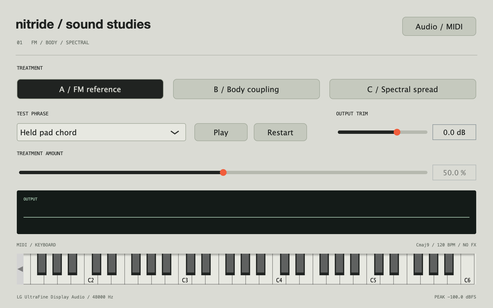

# Sound studies 01

Two audible hypotheses sharing a simple FM source. These are isolated listening
experiments, not the final synth architecture or finished sound design.

The app now defaults to the fifth listening pass. Select **Study 01** in its header
to use this original comparison. See `SOUND_STUDIES_02.md` for the stronger
interaction and phase/delay experiments, richer source, and monophonic lead phrase.



## Listen interactively

```sh
make studies
```

The native **Nitride Sound Studies** app has three treatments:

- **A / FM reference:** the shared source with no treatment.
- **B / Body coupling:** a small nonlinear resonator system with feedback into FM.
- **C / Spectral spread:** gradual deformation of the FM sideband frequencies.

Choose a test phrase and press **Play**. Switch A/B/C during playback and move the
amount slider. **Restart** starts the phrase again. **Stop** releases the notes.
The on-screen keyboard and selected external MIDI inputs also play the source.
Use **Audio / MIDI** to choose an output or enable a MIDI device. Click the keyboard
to focus it for computer-key playing.

Test phrases:

| Phrase | Purpose |
| --- | --- |
| Held pad chord | Cmaj9 voicing; assess sustain, tuning, blend and restrained settings. |
| Short notes | Eight pitches with the same velocity; hear attacks and decay. |
| Velocity changes | The same pitch at different velocities; hear amplitude-dependent response. |
| Amount sweep | Hold a chord while amount moves 0 → 100 → 0, with a brief full-amount plateau. |

Timing is fixed at 120 BPM. Pad attack is 650 ms and release is 1.4 s. Short notes
have a 3 ms attack and a shorter decay/release. There are no external samples,
learned models, reverb, or stereo widening. Both output channels carry the same signal.

The live body treatment has a fixed amount-dependent level compensation derived
from these phrases (roughly +1.46 dB at 50% and +3.35 dB at 100%). Spectral
compensation is approximately +0.41 dB at 50% and +0.025 dB at 100%.
This is not automatic gain control: velocity and envelopes retain
their effect. Use output trim for any remaining perceived-loudness difference.

## Matched WAV comparisons

```sh
make render-studies
```

Writes 18 files to `build/sound-studies/`, plus `levels.csv` and listening notes:

- `pad`, `hits`, `velocity`: FM reference, body 50% / 100%, spectral 50% / 100%.
- `sweep`: FM reference, body sweep, spectral sweep.

Each variant of a phrase is normalized to that phrase's reference broadband RMS.
This controls a large part of the level bias but is not perceptual/LUFS matching.
Files are 48 kHz, stereo, 24-bit PCM and contain one complete phrase. Peaks are
checked before writing so normalization cannot silently clip. The CSV records raw
RMS, matching gain, final RMS, and peak.

## What the two mechanisms actually do

### Shared source

A two-operator phase-modulated sine with a 2:1 modulator ratio and fixed index 1.65.
The reference is reconstructed from its analytic Bessel sidebands. Both candidates
use that same spectrum; zero treatment reconstructs the reference sample for sample
within numerical tolerance. Twelve folded sidebands and a Nyquist taper are used.

There are twelve voice slots, fixed note envelopes, 25 ms parameter/mode smoothing,
4× internal sample rate, and a shared low-pass decimation stage and soft output ceiling.
This is a deliberately small source for comparing the mechanisms fairly.

### B: nonlinear body coupling

Four damped resonators at frequency ratios 1, 2.17, 3.91 and 6.32. Their stiffness
changes with displacement. Resonators couple to neighbouring modes and their
weighted output affects the FM modulator's phase, closing the interaction loop.
Velocity and the envelope affect excitation.

The single amount control raises feedback, nonlinear stiffness, inter-mode coupling,
and the contribution of the body response. This is a bundled experimental mapping
to explore an audible range. It is not a measured model of a specific physical object.

### C: spectral deformation

The source's odd-harmonic sidebands are rendered with independent, continuous phases.
Their spacing stretches progressively, with higher partials moving further; the
fundamental stays at the played frequency. High partials taper out before Nyquist.
The same control blends between the reference and deformed spectra so returning
to zero restores the reference even after partial phases have drifted. This avoids
resetting phases abruptly.
This is live partial-domain synthesis, not an FFT effect or imported spectral sample.

It tests one concrete spectral operation. It does not yet implement partial smearing,
formant transfer, spectral freezing, or an assortment of unrelated transformations.

## What to evaluate

1. Does either treatment produce a recognizable and desirable sound family?
2. Are the intermediate positions worth playing, not just the extremes?
3. Does a quiet pad remain useful, and can the same mechanism make a striking hit?
4. Do velocity and control movement create a satisfying response?
5. Is the useful behavior substantially different from ordinary FM and filtering?

Numerical checks can establish correct source reconstruction, deterministic block
behavior, bounded output and note release. They cannot decide whether these sound
interesting. The next design decision should come from listening to these studies.

## Verification / files

```sh
make test
```

Tests cover source equivalence, zero-amount identity, block-size independence,
three sample rates, neutral return after a sweep, treatment-induced signal changes, high-coupling polyphony,
and complete note release. The native app also has an optional `--audio-check`
argument for a short CoreAudio playback check; it reports output, CPU, xruns and
numerical faults.

- `Source/Studies/StudyEngine.*`: allocation-free native DSP core.
- `Source/Studies/StudyApplication.cpp`: audition UI, audio device and MIDI handling.
- `Source/Studies/RenderStudies.cpp`: matched comparison exporter.
- `Source/Studies/StudyTests.cpp`: deterministic DSP checks.

The main AU and its original Standalone remain the UI study. These experimental
voices are in a separate native app so we can evaluate the sound before committing
their architecture or controls to the instrument.
