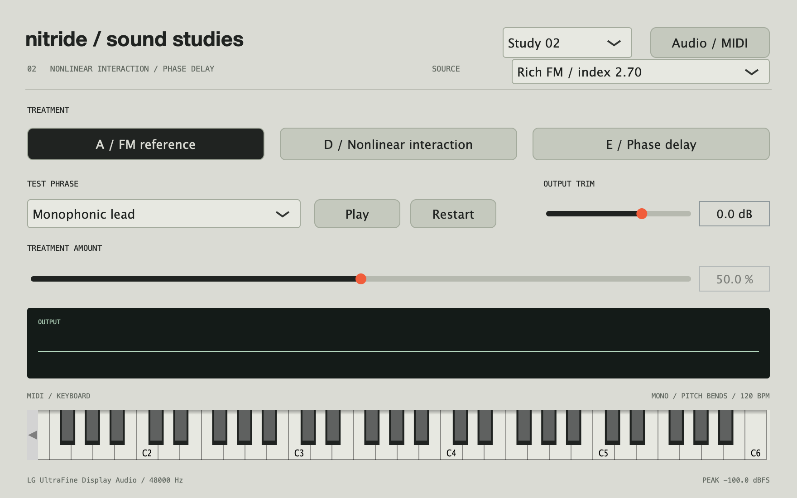

# Sound studies 02

The app now defaults to Study 05. Select **Study 02** in the header for the D/E
comparison described here. See `SOUND_STUDIES_03.md` for the note-coupled follow-up
at 30/70/100%, and `SOUND_STUDIES_04.md` for adaptive oscillator coupling.

The second listening pass tests stronger transformations as playable voices,
following the first-pass feedback: B was musical, C pointed toward interesting
effects, but neither reached the desired degree of transformation. The broader
sonic reference is SOPHIE's *Faceshopping*, not a reconstruction of its patches.



## Listen

```sh
make studies
```

Select **Study 02**, **Rich FM**, and **Monophonic lead**. Press Play.

| Treatment | Main control | Listening hypothesis |
| --- | --- | --- |
| A / FM reference | None | Shared source and articulation for judging the change. |
| D / Nonlinear interaction | Interaction | A coupled source/body system with a different dynamical response. |
| E / Phase delay | Deformation | Audio-rate movement of a feedback read head interacting with FM phase. |

Compare 25%, 50%, and 100%, then explore between them. Change Source to **Simple FM**
to distinguish a mechanism's character from the richer starting spectrum. The
held-pad and sweep tests remain available. Selecting **Study 01** restores the
original A/B/C comparison and its simple-source pad defaults.

The live level compensation uses fixed, source-specific gain curves measured from
the lead and pad renders. It preserves dynamic differences rather than measuring
the current audio and applying AGC. Output trim is available for remaining perceived
level differences. Matching broadband RMS is not the same as matching perceived
loudness or LUFS.

## Sources and articulation

Both sources are the same two-operator FM architecture with a 2:1 ratio:

- **Simple:** index 1.65, as in Study 01.
- **Rich:** index 2.70, with more energy in upper sidebands.

Switching source crossfades its analytic sideband amplitudes over 25 ms. The native
audio-rate feedback branches interpolate the FM index across the same transition.

The eight-second lead phrase uses repeated notes, different velocities, short
attacks, longer gates, and pitch bends. Lead voices retrigger their envelope from
the current level while retaining phase and feedback state; pitch glides over a
25 ms smoothing time. The lead envelope has a 6 ms attack, 160 ms decay, 62% sustain,
and 160 ms release. The phrase's bends range from -5 to +4 semitones.

The on-screen keyboard and selected MIDI devices use lead articulation when the
lead phrase is selected. MIDI pitch wheel maps to ±2 semitones. Other test phrases
retain their existing pad or hit articulation. Tempo is fixed at 120 BPM.

## D: nonlinear interaction

This uses a separate four-mode body from B, with ratios 1, 1.414, 2.73 and 4.18.
Small-displacement stiffness softens as interaction increases; larger displacements
harden the modes. Neighbouring modes interact through a signed cross-coupling term.
The body's state feeds back into the FM modulator, with a third-harmonic modulation
component introduced by the same control. A bounded nonlinear response limits the
states and shapes the returned signal.

The main control bundles feedback, softening/hardening, cross-coupling and the blend
with the original voice. This remains a simplified exploratory model, not a calibrated
simulation of a specific material. Its audible value needs listening evaluation.

## E: phase/delay deformation

A per-voice short delay is read through a four-point fractional interpolator. Its
nominal length tracks the note frequency. The read position moves at audio rates,
driven by phase and the returning signal. The delayed signal modifies FM phase and
is recursively fed back into the delay.

The main control changes read-head movement, phase deformation, feedback and blend.
This changes the generated structure rather than stretching a static set of partials.
The delay is a voice-internal mechanism, not a reverb or stereo effect. Its storage is
fixed and allocated with the engine, with no audio-thread buffer allocation.

All paths use a 4× internal rate and shared low-pass decimation/output stages. These
are listening prototypes; no claim is made that their extreme ranges are a finished
production engine or a commercially unique algorithm.

## Matched files

```sh
make render-studies-02
```

Writes **34 stereo 24-bit, 48 kHz WAVs** to `build/sound-studies-02/`:

- Each source: lead and pad with A, D at 25/50/100%, E at 25/50/100%.
- Each source: a sweep comparison for A, D and E.

Examples:

```text
rich_lead_A_fm.wav
rich_lead_D_interaction_50.wav
rich_lead_E_phase_delay_100.wav
simple_pad_D_interaction_25.wav
```

Within each source/phrase group, all files share the reference's broadband RMS.
If matching would exceed headroom, every file in that group is reduced by the same
additional factor. `levels.csv` records raw RMS, applied gain, final RMS and peak.
The original 18 comparisons remain under `build/sound-studies/`.

## Questions for listening

1. Does D or E feel like a new voice with a recognizable identity?
2. Is there a useful boundary between controlled and unstable behavior?
3. Which intermediate settings are worth playing as an actual part?
4. Does the richer source help, or simply add brightness and density?
5. Can a restrained setting still make a useful pad?

## Verification

`make test` checks both source reconstructions, all treatments at three sample
rates, neutral return, block-size independence, bounded high-polyphony rendering,
lead gate/bend timing and an audible pitch-bend frequency change.

The native app's `--audio-check` exercises D and E on both the lead and pad,
reporting device, output peak, CPU, xruns and numerical faults. This pass was checked
on CoreAudio at 48 kHz with zero xruns and zero numerical faults.
