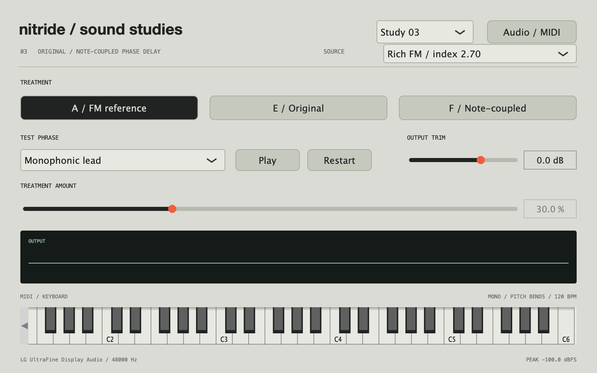

# Sound studies 03 / phase-delay coupling

The app now defaults to Study 05. Select Study 03 in the header for the comparison
described here. F at 50% is retained as the benchmark in the subsequent pass.

This pass responds to the reported behavior of E:

- Around 30%: an interesting velocity-responsive distortion within the note.
- Around 70%: a distortion/noise layer seeming to run alongside the note.
- At 100%: largely a distortion/noise texture.

The experiment asks whether the transformed sound can remain connected to the
note while retaining its unusual character. The original E is preserved; F is a
new variation, not a declared replacement.



## Listen

```sh
make studies
```

Select **Study 03**, **Rich FM**, **Monophonic lead**, and amount 30%.

| Treatment | Purpose |
| --- | --- |
| A / FM reference | Shared source and performance. |
| E / Original | The unchanged mechanism from Study 02. |
| F / Note-coupled | Revised excitation, recirculation and pitch-related delay movement. |

Press Play and compare E and F at **30%, 70%, and 100%**. Then try Velocity changes
and the held pad chord. Selecting Study 02 restores D/E; Study 01 restores B/C.

The key questions are whether F remains part of the note at 70–100%, whether it
responds usefully to velocity, and whether it retains enough of E's character. It
may turn out to be a different useful voice rather than a better version of E.

## Technical hypothesis

E's original read-head motion includes incommensurate multiples of a wrapped base
phase. Some of that motion changes discontinuously when the base phase wraps.
Its nonlinear recirculation term also has a small-signal slope of 1.17 at maximum
amount before saturation, allowing self-sustaining behavior when excitation is weak.
Its internal excitation continues at a significant fraction of its level as the
outer amplitude envelope decays. These are plausible contributors to the perceived
separation; they do not establish the subjective cause by themselves.

F changes the interaction within the voice:

- Read-head movement follows note harmonics and a continuously advanced half-rate
  phase. Pitch bends and glide move those phases with the note.
- Excitation is scaled by the note's actual envelope and velocity.
- Read-head and phase deformation respond to that excitation strength.
- Recirculation is below unity, with an upper coefficient of 0.60, and decreases
  with the envelope. Without excitation, the delay response decays.
- The delay remains in the FM phase-feedback path and can still generate complex
  nonlinear structure. No extra low-pass filtering or added clean tone is used to conceal
  the upper-range behavior.

Both versions use the same amount-dependent dry/transformed blend as before.
At 100%, the transformed branch is the entire voice; returning amount to zero
restores the shared reference. E and F have independent delay memory, so their
states do not interfere during an A/B crossfade.

## Matched comparisons

```sh
make render-studies-03
```

Writes 34 stereo 24-bit / 48 kHz WAVs to `build/sound-studies-03/`:

- Simple and rich source profiles.
- Lead and pad: A plus E and F at 30%, 70%, and 100%.
- Each source: A/E/F sweep from 0 → 100 → 0.

Examples:

```text
rich_lead_E_original_70.wav
rich_lead_F_note_coupled_70.wav
simple_pad_F_note_coupled_100.wav
```

Each source/phrase group has matching broadband RMS, with common headroom reduction
if necessary. Matching RMS does not guarantee equal perceived loudness. The CSV
records actual gains and peaks. Live compensation uses fixed curves derived from
the lead/pad results; it is not AGC and does not remove velocity differences.

## Verification

The new path is covered by the existing tests for both sources at 44.1/48/96 kHz,
zero-amount identity, neutral return, block-size independence, high-polyphony
rendering, note release, and lead gate/pitch-bend behavior. Native CoreAudio checks
exercise E/F on both lead and pad. This pass completed at 48 kHz with no xruns or
numerical faults. Sound quality and the perceived connection to the note remain
listening judgments.
