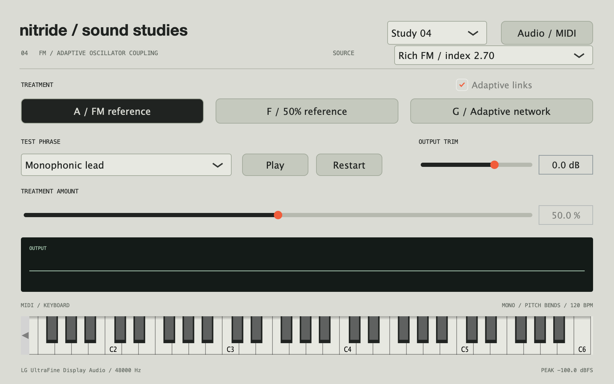

# Sound studies 04 / adaptive oscillator coupling

The app now defaults to Study 05's extended network range. Select Study 04 in the
header for the F/G benchmark and adaptive-link comparison described here.

This pass tests a recombination rather than adding more mathematics for its own
sake: FM generation, note-referenced phase synchronization, and adaptive connection
strengths in one voice. The listening benchmark is F at 50%, the strongest reported
setting from the prior pass.

The ingredients are established techniques. The novelty hypothesis is the specific
playable behavior they produce together, not a claim that the algorithms are new
or that no other instrument has used a related combination.



## Listen

```sh
make studies
```

Select Study 04, Rich FM, Monophonic lead, and amount 50%.

- **A / FM reference:** the plain two-operator source.
- **F / 50% reference:** the prior note-coupled delay voice, fixed at 50% regardless
  of G's amount control or an automatic sweep.
- **G / Adaptive network:** the new oscillator-coupling voice.

Start by comparing F against G at 50%. Explore G at 30%, 70%, and 100%, then compare
the pad and velocity phrases. **Adaptive links** toggles adaptation for G, returning
connection strengths to their initial fixed values when disabled. The transition
is smoothed and does not reset oscillator phases.

F's amount display is disabled and fixed at 50%. The earlier studies remain
available in the header. MIDI and the on-screen keyboard use the existing note
articulation. No model downloads, samples, or neural models are involved.

## What is being recombined

Six oscillators are referenced to the played note at integer ratios 1, 2, 3, 5, 7
and 9. Each has a phase offset that can drift and be pulled by other offsets. The
fundamental has the strongest pitch-reference pull.

Nine connections form a ring plus cross-connections. Some are attractive and some
repulsive, so the system need not collapse into one aligned phase state. With
adaptation enabled, their strengths follow phase alignment with a 25 ms timescale
weighted by the note's excitation. The edge list and signs remain fixed; it is
the strengths that adapt, not arbitrary routing or the creation of new connections.

A note-on supplies a velocity-dependent transient drive, decaying over 35 ms.
Velocity and the amplitude envelope affect coupling and adaptation. The same
connection strengths participate in the FM modulation sum. The generated waveform
also feeds back into the phase dynamics, weighted by excitation.

This is direct sound generation by the interacting system, not an effect operating
on a completed FM voice. Lead retriggers retain phase and connection state while
the voice remains active. Glide and pitch bends move the common frequency reference.

Both source profiles use the same network parameters. The source selector changes
only the FM index (1.65 or 2.70), helping separate the network's behavior from a
richer initial spectrum.

The main **Network interaction** control changes drift, phase pulling, transient
response and additional FM contribution. As in the earlier studies, it also blends
from the reference into the generated branch; zero returns to the reference.

## The fixed-link comparison

With adaptation disabled, connections target the same initial signed strengths
of ±0.55. Oscillator coupling, note excitation and FM generation remain active.
Offline fixed-link files begin at those strengths. The live toggle smoothly
returns the current strengths to them.

This is an ablation: it asks whether the adaptive component contributes something
worth hearing. It does not separately isolate phase pulling from the adaptive FM
modulation sum. A numerical test verifies that enabling adaptation affects the
generated signal; whether that difference is useful is a listening judgment.

## Matched comparisons

```sh
make render-studies-04
```

Writes 60 stereo 24-bit / 48 kHz WAVs to `build/sound-studies-04/`:

- Simple and rich sources.
- Lead, pad and velocity phrases.
- Each group: A, F at 50%, G at 30/50/70/100% with adaptive links, and G at the same
  positions with fixed links.

Examples:

```text
rich_lead_F_reference_50.wav
rich_lead_G_adaptive_50.wav
rich_lead_G_fixed_50.wav
simple_velocity_G_adaptive_70.wav
```

All files in a source/phrase group have matched broadband RMS and common headroom
adjustment if needed. The CSV reports actual levels and gains. This is not LUFS or
perceptual loudness matching. Live compensation is a fixed curve measured from
lead/pad renders for each source and adaptation setting, not AGC.

## What would make this worth pursuing?

1. A recognizable behavior or timbral family beyond a fuller/brighter FM tone.
2. A satisfying change in formation or articulation as notes and velocity change.
3. Useful intermediate positions and a coherent pitch reference.
4. Something desirable that adaptive links add over fixed coupling.
5. A reason to choose G over F at 50% in a musical part.

If the extra structure is technically active but does not create a compelling
audible difference, this experiment does not earn its place as the signature feature.

## Verification

DSP checks cover both sources, three sample rates, neutral return, block-size
independence, high-polyphony rendering, note release, and lead gates/pitch bends.
Additional checks establish that adaptation changes the generated signal and that
the fixed F reference stays at 50% during a sweep.

The native audio check exercises F/G on lead and pad, plus G with fixed links. DSP
is optimized even in Debug, while the native UI retains a standard Debug build,
to keep the audition within the real-time audio budget.
